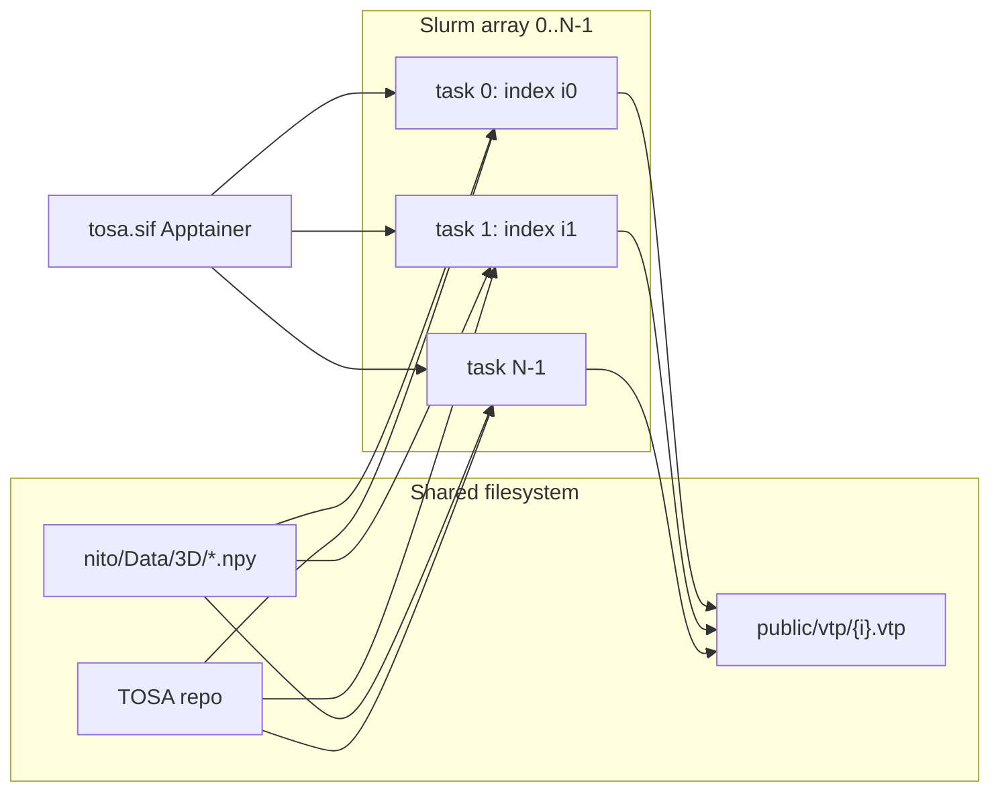

# Batch voxel → VTP on Arizona HPC

Guide for running `voxel2surf` at scale on University of Arizona HPC (Ocelote / Puma) to produce tagged `.vtp` surfaces from the NITO 3D voxel bundle.

## Overview

Each NITO sample is independent. The natural batch unit is **one Slurm array task → one index → one `.vtp`**.

```text
NITO index i  →  voxel2surf  →  public/vtp/<i>.vtp
```

The 3D train set has ~106k samples (`scripts/fetch/data_3d.py`). Use **job-array parallelism** (many single-sample jobs), not one giant multi-core job.



**Per-sample CLI** (already in the repo):

```bash
python scripts/lib/converters/voxel2surf.py \
  --index 119 \
  --data-dir nito/Data/3D \
  -q \
  -o public/vtp/119.vtp
```

`-q` suppresses step-by-step logging; useful for batch logs.

## 1. Environment on UA HPC: Apptainer

UA HPC uses **Apptainer** (`apptainer`; `singularity` is an alias). Docker does not run on compute nodes. Convert the existing `tosa:latest` image to a `.sif` file **on a compute node** (not the login node).

```bash
# Request an interactive compute session first, e.g.:
# salloc --account=<group> --partition=standard --ntasks=1 \
#        --cpus-per-task=4 --mem=16G --time=2:00:00

cd $SCRATCH/TOSA

# From a locally built Docker image (after docker compose build on your workstation
# and docker save, or build on a machine with Docker):
apptainer build tosa.sif docker-daemon://tosa:latest

# Or from a registry:
# apptainer build tosa.sif docker://<registry>/tosa:latest
```

Avoid filling the 50 GB home quota with Apptainer layer cache:

```bash
export APPTAINER_CACHEDIR=$SCRATCH/.apptainer
```

**Smoke test** one sample inside the container:

```bash
apptainer exec --pwd "$SCRATCH/TOSA" \
  --bind "$SCRATCH/TOSA:/workspace" \
  "$SCRATCH/TOSA/tosa.sif" \
  python scripts/lib/converters/voxel2surf.py \
    --index 119 \
    --data-dir nito/Data/3D \
    -q \
    -o /workspace/public/vtp/119.vtp
```

**Alternative:** install the `tosa` conda env from `environment.yml` with micromamba on HPC instead of a SIF. The container matches the Docker workflow documented in `README.md` and is easier to keep reproducible.

## 2. Data and output layout

| Path | Purpose |
|------|---------|
| `$SCRATCH/TOSA` | Git clone of this repo |
| `$SCRATCH/TOSA/nito/Data/3D/` | NITO 3D bundle (~4.3 GB `topologies.npy`) |
| `$SCRATCH/TOSA/public/vtp/` | Output tagged VTK surfaces |
| `$SCRATCH/TOSA/logs/` | Slurm stdout/stderr |
| `$SCRATCH/TOSA/batch/` | Index lists, sbatch scripts |

Fetch data once (from a machine with network access, or on HPC if Drive download works):

```bash
./scripts/fetch/data_3d.sh
# → nito/Data/3D/{shapes,topologies,boundary_conditions,loads,vfs}.npy
```

Keep large artifacts on **scratch**, not `$HOME`.

## 3. Slurm job-array template

Save as `batch/voxel2vtp.sbatch` (paths adjusted for your account):

```bash
#!/bin/bash
#SBATCH --job-name=voxel2vtp
#SBATCH --account=<your_group>
#SBATCH --partition=standard          # Ocelote; use Puma partition names on Puma
#SBATCH --array=0-999%200             # first 1000 list rows; max 200 concurrent
#SBATCH --cpus-per-task=2
#SBATCH --mem=8G
#SBATCH --time=00:30:00
#SBATCH --output=logs/voxel2vtp_%A_%a.out
#SBATCH --error=logs/voxel2vtp_%A_%a.err

set -euo pipefail

WORKDIR=$SCRATCH/TOSA
OUT_DIR=$WORKDIR/public/vtp
SIF=$WORKDIR/tosa.sif
LIST=$WORKDIR/batch/indices_3d.txt    # one NITO index per line

mkdir -p "$OUT_DIR" logs

IDX=$(sed -n "$((SLURM_ARRAY_TASK_ID + 1))p" "$LIST")
OUT="$OUT_DIR/${IDX}.vtp"

# Idempotent reruns
[[ -f "$OUT" ]] && exit 0

export OMP_NUM_THREADS=${SLURM_CPUS_PER_TASK:-1}

apptainer exec --pwd "$WORKDIR" --bind "$WORKDIR:/workspace" "$SIF" \
  python scripts/lib/converters/voxel2surf.py \
    --index "$IDX" \
    --data-dir /workspace/nito/Data/3D \
    -q \
    -o "/workspace/public/vtp/${IDX}.vtp"
```

**Index list** — one integer per line (array task `k` reads line `k+1`):

```bash
mkdir -p batch logs

# All 3D indices (after inspect_dataset is run on the bundle):
python scripts/voxel/inspect_dataset.py --data-dir nito/Data/3D --list-3d --limit 0 \
  > batch/indices_3d_raw.txt
# Keep only the numeric lines (skip header text from inspect output), or generate manually:
# seq 0 105999 > batch/indices_3d.txt

sbatch batch/voxel2vtp.sbatch
```

**Starting resource guess** for ~32³ grids: 2 CPUs, 8 GB RAM, 30 min wall time. Run a pilot array of ~20 indices and adjust from `sacct` / log timing.

## 4. Critical bottleneck: per-task data loading

Today `voxel2surf` loads the **entire** NITO bundle per invocation via `load_nito_arrays()` in `scripts/lib/nito_io.py`, including full `topologies.npy` (~4.3 GB). That does not scale to hundreds of concurrent array tasks.

**Before a full ~106k run**, switch to per-index lazy I/O, e.g. mmap:

```python
topologies = np.load(path, allow_pickle=True, mmap_mode="r")
rho = np.asarray(topologies[index], dtype=float)  # copy one sample only
```

Small metadata arrays (`shapes`, `boundary_conditions`, `loads`, `vfs`) can load fully or mmap as well.

| Approach | Pros | Cons |
|----------|------|------|
| **mmap in `nito_io`** (recommended) | Clean; scales to 106k | Requires a small code change |
| **Low array concurrency** (`%20`) | Works with current code | Very slow wall clock |
| **Pre-shard voxels** to per-index `.npy` | No shared-array contention | One-time prep job |

See also `README.md` (“Per-index lazy loading for 3D batch runs”).

## 5. Post-run checks

Use `scripts/volume/check.py` to spot-check volume fractions:

```bash
# Compare voxel vs VTP for one index
python scripts/volume/check.py compare --index 119 --data-dir nito/Data/3D

# Single VTP check
python scripts/volume/check.py vtp --index 119
```

A second small job array can verify any index whose `.vtp` is missing or suspect.

## 6. Suggested rollout

1. **Pilot** — array over indices `0–99`; record time and max RSS per task.
2. **Fix I/O** — mmap / `load_sample_by_index()` in `lib/nito_io.py`; point `voxel2surf` at it.
3. **Scale** — full `indices_3d.txt`; raise concurrency (`%200`–`%500`) once memory per task is confirmed low.
4. **Idempotent reruns** — skip if `public/vtp/$IDX.vtp` already exists (see sbatch template).
5. **Sync** — copy `public/vtp/` from scratch to long-term storage when the batch completes.

## 7. Related commands

| Command | Role |
|---------|------|
| `scripts/lib/converters/voxel2surf.py` | Voxel → tagged `.vtp` (canonical surface path) |
| `scripts/volume/check.py` | Volume fraction QA (voxel / STL / VTP) |
| `scripts/surface/visualize.py` | PyVista view of boundary tags |
| `scripts/voxel/inspect_dataset.py` | 2D/3D index lists and shape templates |
| `scripts/fetch/data_3d.sh` | Download NITO 3D train bundle |
| `Dockerfile`, `docker-compose.yml` | Build `tosa` image for Apptainer conversion |

## References

- [UA HPC containers (Apptainer)](https://hpcdocs.hpc.arizona.edu/software/containers/containers_on_hpc/)
- [Using containers on UA HPC](https://hpcdocs.hpc.arizona.edu/software/containers/using_containers/)
- TOSA `README.md` — Docker workflow, NITO data layout, RAM notes
