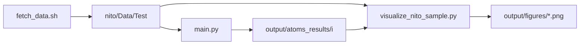

# TOSA

**Topology Optimization Sensitivity Analysis** — compliance \(C\) and design sensitivities \(\partial C / \partial \rho\) for NITO-3D topologies under fixed loads and boundary conditions.

Forward FEA and gradients use **ATOMS** (from the [`nito`](nito/) submodule). Deeper notes, schema, and ANSYS-oriented background: [output/README.md](output/README.md).

## Prerequisites

- Git with submodules: `git submodule update --init nito`
- Conda (recommended): `conda env create -f environment.yml` then `conda activate tosa`

## From data to figures

Run from the **repository root**.

### 1. Download NITO data

Test split only (~85 MB, 2D samples — good for the sprint):

```bash
conda activate tosa
./scripts/fetch_data.sh --test-only
```

Data lands in `nito/Data/Test/` (`shapes.npy`, `topologies.npy`, `boundary_conditions.npy`, `loads.npy`, `vfs.npy`).

Full train + test (~4.7 GB):

```bash
./scripts/fetch_data.sh --full
```

### 2. (Optional) Inspect the dataset

```bash
python scripts/inspect_nito_dataset.py --test
python scripts/visualize_nito_sample.py --index 0 --test
```

### 3. Run sensitivity analysis (ATOMS)

Compute compliance and \(\partial C / \partial \rho\) for sample index `i`:

```bash
python scripts/sensitivity_analysis/main.py --index 0 --test
```

Optional finite-difference spot check:

```bash
python scripts/sensitivity_analysis/main.py --index 0 --test --verify-fd
```

Writes **`output/atoms_results/<index>/`**:

| File | Content |
|------|---------|
| `compliance.npy` | Scalar \(C\) |
| `dC_drho.npy` | Gradient w.r.t. element \(\rho\) |
| `displacement.npy` | Nodal displacements |
| `rho.npy`, `shape.npy` | Design and grid (copy for a self-contained result folder) |

Re-run with another index: `--index 1`, etc. Omit `--test` to use `nito/Data/` (train).

### 4. Plot topology + gradient

Requires step 3 for gradient panels.

```bash
# ρ and raw ∂C/∂ρ (side by side)
python scripts/visualize_nito_sample.py --index 0 --test --with-gradient

# Binary-friendly mask: void & ∂C/∂ρ<0 (fill), solid & ∂C/∂ρ>0 (remove)
python scripts/visualize_nito_sample.py --index 0 --test --gradient-binary

# Save without opening a window
python scripts/visualize_nito_sample.py --index 0 --test --gradient-binary \
  --no-show --save output/figures/sample_0.png
```

Figures go under **`output/figures/`** (gitignored except `.gitkeep`; regenerate anytime).

### 5. Batch many samples (shell)

```bash
for i in $(seq 0 9); do
  python scripts/sensitivity_analysis/main.py --index "$i" --test
  python scripts/visualize_nito_sample.py --index "$i" --test --gradient-binary \
    --no-show --save "output/figures/sample_${i}.png"
done
```

## Pipeline overview



## Layout (generated vs tracked)

| Path | In git? | Role |
|------|---------|------|
| `nito/Data/` | No (`.gitignore`) | Downloaded `.npy` bundles |
| `output/atoms_results/` | No (except `.gitkeep`) | Sensitivity outputs |
| `output/figures/` | No (except `.gitkeep`) | PNG exports |
| `scripts/` | Yes | Fetch, FEA/sensitivity, visualization |
| `output/README.md` | Yes | Sprint guide and data schema |

## Scripts

| Script | Purpose |
|--------|---------|
| `scripts/fetch_nito_data.py` | Download NITO data (called by `fetch_data.sh`) |
| `scripts/inspect_nito_dataset.py` | 2D/3D counts and shape templates |
| `scripts/sensitivity_analysis/main.py` | ATOMS: \(C\), \(\partial C / \partial \rho\) |
| `scripts/visualize_nito_sample.py` | 2D Matplotlib / 3D PyVista; `--with-gradient`, `--gradient-binary` |
| `scripts/nito_io.py` | Shared NITO `.npy` loading helpers |
