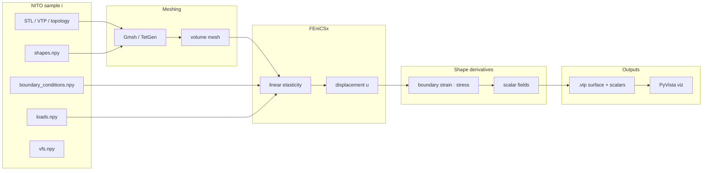
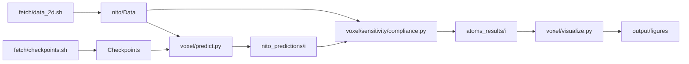

# TOSA

**Topology Optimization Sensitivity Analysis** — shape derivatives of structural and manufacturing objectives on NITO-3D designs, with a focus on **laser powder bed fusion (LPBF)**.

Forward FEA and shape-derivative post-processing use **FEniCSx** (surface workflows; in progress) and **ATOMS** (archived voxel density-based compliance sensitivities). **PyVista** scripts visualize scalar fields on surfaces (`.vtp`) and voxel designs.

**Current objectives**

| Objective | Status |
|-----------|--------|
| Compliance | WIP (voxel ∂C/∂ρ via archived ATOMS path; surface path via FEniCS) |
| Recoater interference (LPBF) | WIP |
| Manufacturing Von Mises stress (LPBF) | WIP |
| Base plate separation distortion (LPBF) | WIP |

LPBF objectives follow [Bihr et al. (2022)](https://linkinghub.elsevier.com/retrieve/pii/S0045782522002274).

Fetch scripts target the public [NITO dataset](https://drive.google.com/drive/folders/1uK_X3-FcCWY9LiiXkVQDI69q0t6Vosgm) (Nobari, Regenwetter, Ahmed, 2024): voxel topologies iso-surfaced with marching cubes and smoothing, distributed as VTK PolyData (`.vtp`). Legacy `.stl` mirrors may exist during conversion. See the [NITO-3D paper](https://decode.mit.edu/assets/papers/nobari_2024_nito3d.pdf), [NITO_Public](https://github.com/ahnobari/NITO_Public), and [public/ATTRIBUTION.md](public/ATTRIBUTION.md).

## Prerequisites

- Git with submodules: `git submodule update --init nito`

All default dependencies live in **`environment.yml`** (conda-forge + pip: PyTorch, Gmsh, TetGen, FEniCSx, PyVista, ATOMS/scikit-sparse). Upstream NITO **training** uses `nito/environment.yml` (CUDA) — do not use that for TOSA.

Data and outputs are **not** baked into the image; download on the host (or inside the container — the repo is bind-mounted):

```bash
./scripts/fetch/data_2d.sh --test-only    # 2D test split
# ./scripts/fetch/data_3d.sh           # 3D train
# ./scripts/fetch/stl.sh --indices 0
```

### Docker vs local

| | **Docker (default)** | **Local conda/micromamba** |
|--|----------------------|----------------------------|
| **Install** | `docker compose build tosa` | `micromamba env create -f environment.yml && micromamba activate tosa` |
| **Run** | `docker compose run --rm tosa bash` | `conda activate tosa` |
| **Best for** | FEniCSx, batch jobs, Apple Silicon hosts | Quick 2D / ATOMS density SA on Linux x86_64 |
| **Platform** | `linux/amd64` (see below) | Native OS; FEniCSx/Gmsh can be finicky on macOS ARM |

**Requirements:** [Docker Desktop](https://www.docker.com/products/docker-desktop/) (or Docker Engine + Compose v2). First build downloads conda packages and PyTorch wheels (~2 GB+); allow 15–30 minutes on a cold cache.

**Image (`tosa:latest`):** micromamba env from `environment.yml` — Python 3.10, PyTorch, ATOMS/scikit-sparse, FEniCSx, Gmsh, TetGen, PyVista, Jupyter. Build ends with an import smoke test (`dolfinx`, `gmsh`, `tetgen`, `meshio`, `pyvista`, `torch`). See [`Dockerfile`](Dockerfile) and [`docker-compose.yml`](docker-compose.yml).

**Why `linux/amd64`:** `scikit-sparse` (ATOMS Cholesky) has no conda-forge build for `linux/arm64`. On Apple Silicon, Docker otherwise defaults to arm64 and the env solve fails. Compose and the Dockerfile pin `linux/amd64`; the container runs under x86_64 emulation on ARM Macs — slower than native arm64, but required for the full stack.

**Bind mount:** the repo root is mounted at `/workspace` (`.:/workspace` in compose). Edits on the host are visible in the container; `nito/Data/`, `output/`, checkpoints, and figures persist on the host without rebuilding. Submodule `nito/` must exist on the host (`git submodule update --init nito`) before running ATOMS/NITO scripts.

**Environment (compose):**

| Variable | Default | Role |
|----------|---------|------|
| `OMP_NUM_THREADS` | `4` | OpenMP threads for BLAS / parallel libs |
| `PETSC_OPTIONS` | `-ksp_type preonly -pc_type lu` | Direct LU for FEniCSx linear solves |

Override at run time, e.g. `OMP_NUM_THREADS=8 docker compose run --rm tosa …`.

**Docker workflow**

```bash
git submodule update --init nito
docker compose build tosa
./scripts/fetch/data_2d.sh --test-only   # on host; writes into nito/Data/
docker compose run --rm tosa bash
# inside container (cwd /workspace):
python scripts/voxel/sensitivity/compliance.py --index 0 --test
python scripts/voxel/visualize.py --index 0 --test --no-show \
  --save output/figures/sample_0.png
```

One-shot (no interactive shell):

```bash
docker compose run --rm tosa python scripts/voxel/predict.py --index 3 --test
docker compose run --rm tosa python scripts/voxel/visualize.py --index 119 \
  --data-dir nito/Data/3D --no-show --save output/figures/sample_119.png
```

Use `--no-show --save …` for PyVista — there is no display server in the container. Fetch scripts can also run inside the container; running them on the host is usually simpler since the data directory is shared via the mount.

**Local workflow**

```bash
git submodule update --init nito
micromamba env create -f environment.yml && micromamba activate tosa
./scripts/fetch/data_2d.sh --test-only
python scripts/voxel/sensitivity/compliance.py --index 0 --test
```

If `import gmsh` fails after install on macOS: `brew install gmsh`, then retry in the same env. For FEA work on Apple Silicon, prefer Docker over fighting native DOLFINx builds.

**What the env covers vs what’s implemented**

| Ready in env | Runnable today |
|--------------|----------------|
| ATOMS, PyTorch, PyVista, Gmsh, TetGen, FEniCSx | Fetch, `voxel/predict.py`, `voxel/sensitivity/compliance.py`, voxel/surface viz |
| Surface shape-derivative pipeline | `scripts/surface/sensitivity/main.py` — **not yet implemented** (stub only) |

## Flags and paths

| Flag | Meaning |
|------|---------|
| `--test` | Read `nito/Data/Test/` (2D test split). Omit for train data in `nito/Data/`. |
| `--data-dir PATH` | NITO bundle root (e.g. `nito/Data/3D` for 3D train). |
| `--index i` | Sample `i` in the chosen split (BC, load, shape, vf stay aligned). |

Generated artifacts are gitignored under `nito/Data/`, `nito/Checkpoints/`, `output/atoms_results/`, `output/nito_predictions/`, `output/figures/`, `output/surface_sensitivity/`, `public/stl/`, and `public/vtp/`.

---

## End-to-end pipeline

**Target workflow** (surface shape-derivative SA — `scripts/surface/sensitivity/main.py`, in progress):



**What each stage does**

| Stage | Role |
|-------|------|
| **NITO data** | `topologies[i]` or post-processed `.vtp`/`.stl`; `shapes[i]` grid size; `boundary_conditions[i]` and `loads[i]` (normalized coords — scale by `np.max(shapes[i])`); `vfs[i]` volume-fraction target. |
| **Meshing** | Automatic volume mesh (Gmsh / TetGen); see [Automatic meshing](#automatic-meshing) below. |
| **FEniCSx** | Isotropic linear elasticity; apply NITO BCs/loads; solve for **u**. |
| **Shape derivatives** | On external faces: contract strain and stress (e.g. ε:σ); map to surface mesh scalars for objectives such as compliance and LPBF metrics. |
| **Visualization** | `scripts/surface/visualize.py` colors `.vtp` by point/cell scalars. |

### Automatic meshing

Meshing is **automatic**: from each sample’s surface (`.vtp`/`.stl` or voxel iso-surface) and NITO `boundary_conditions` / `loads`, the pipeline builds a tetrahedral volume mesh with **non-uniform** sizing. A coarse baseline covers the interior; **fine resolution is concentrated only where the physics and the shape-derivative outputs require it**. That keeps batch runs tractable without sacrificing the quantities we actually export on the surface.

Gmsh/TetGen size fields (or equivalent background-mesh controls) are driven by three criteria:

#### 1. Boundary — where shape derivatives live

Surface shape-derivative objectives are evaluated from **boundary data**, not from arbitrary interior points. For compliance-style functionals in linear elasticity, the shape derivative involves a **boundary integral** built from the trace of strain and stress on \(\partial\Omega\) (schematically, a density like \(\varepsilon_{ij}\sigma_{ij}\) on exterior faces). The `.vtp` scalars we publish are defined on the **design surface**, so they inherit whatever accuracy the FEA mesh provides at \(\partial\Omega\).

If boundary faces are too coarse:

- Face quadrature for \(\varepsilon\) and \(\sigma\) is under-resolved, so the contracted field is smeared or biased.
- Face normals and curvature are wrong for thin or iso-surfaced geometry, which distorts both the elastic solution near the surface and any shape-perturbation interpretation.

**Implication:** refine **all exterior surfaces** to resolve geometry and to stabilize boundary stress/strain — not because the bulk displacement is singular, but because **the sensitivity is a boundary trace**.

#### 2. Force locations — Saint-Venant transition

NITO `loads[i]` specify **localized** forces (normalized positions and direction components). In 3D linear elasticity, a point or patch load produces **stress concentrations** near the application region; peak stress and strain energy density are sensitive to how the load is distributed on the mesh.

**Saint-Venant’s principle** says that far from the loaded patch, the stress field is dominated by the **resultant force and moment**, not the exact distribution of tractions. So:

- **Near** the load: mesh must be fine enough that the resultant is applied consistently and local peaks (relevant to compliance and LPBF objectives tied to hot spots) are not artifacts of a single oversized element.
- **Far** from the load: a coarser mesh is acceptable for displacements and for bulk stress that depends only on resultants.

**Implication:** automatic sizing adds a **refinement zone around each load point** (scaled from `np.max(shapes[i])` and a chosen physical load patch), then relaxes element size with distance. BC support regions that fix displacement are meshed adequately for constraint accuracy but do not need the same singularity-driven refinement as loaded patches unless they coincide.

#### 3. Fine geometric features — elliptic interior regularity

In the **interior**, away from boundaries and concentrated loads, linear elasticity is **elliptic**: for smooth material data and body forces, displacement components gain **interior regularity** (Sobolev lifting — roughly, more smoothness away from singular sources). Stress is derived from displacement gradients, so in a smooth interior region, \(\varepsilon\) and \(\sigma\) vary smoothly and do not require a uniform fine mesh to be captured once the **domain geometry** is represented.

That does **not** mean the interior can always be coarse:

- **Thin walls, narrow ligaments, and small holes** must still be spanned by enough elements so the domain \(\Omega\) is correct; that is a **geometric** constraint, not an elliptic-regularity bonus.
- Errors injected at the boundary or near loads propagate inward, but for elliptic problems those errors decay with distance and mesh size in a stable way — so interior coarsening is safe **provided** boundaries, loads, and thin features are already resolved.

**Implication:** use feature-aware sizing (wall thickness, local curvature, gap width from the surface mesh) to refine **only where geometry is thin or highly curved**; allow larger tets in thick, smooth bulk regions.

#### Practical summary

| Region | Typical sizing | Primary reason |
|--------|------------------|----------------|
| Exterior boundary | Fine | Shape-derivative scalars are boundary traces of \(\varepsilon{:}\sigma\) |
| Load patches | Fine | Local traction; Saint-Venant — accuracy needed near application |
| Thin / high-curvature features | Fine to moderate | Geometric fidelity of \(\Omega\) |
| Thick interior bulk | Coarse | Elliptic regularity; resultants dominate far from loads |

Gmsh and TetGen backends apply the same **principle** — finer at the surface layer and load neighborhoods — via `lib/meshing/size_fields.py` and the backend drivers in `lib/meshing/`.

**Implemented today** (voxel density SA — archived, still functional):



---

## A. Ground-truth topology (dataset label)

Problem + design both come from the downloaded bundle (`topologies.npy`).

### 1. Download data

```bash
conda activate tosa
./scripts/fetch/data_2d.sh --test-only    # 2D test: nito/Data/Test/ (~85 MB)
./scripts/fetch/data_3d.sh             # 3D train → nito/Data/3D/ (~4.3 GB topologies)
./scripts/fetch/stl.sh --indices 0 # post-processed STL → public/stl/
```

### 2. Sensitivity (ATOMS — archived voxel ∂C/∂ρ)

```bash
python scripts/voxel/sensitivity/compliance.py --index 0 --test
# optional: --verify-fd
```

Writes **`output/atoms_results/<index>/`**: `compliance.npy`, `dC_drho.npy`, `displacement.npy`, `rho.npy`, `shape.npy`.

### 3. Visualize

```bash
python scripts/voxel/visualize.py --index 0 --test --with-gradient \
  --no-show --save output/figures/sample_0_gt_grad.png

python scripts/voxel/visualize.py --index 0 --test --with-gradient --gradient-binary \
  --no-show --save output/figures/sample_0_gt_grad_binary.png
```

3D train sample (no `--test`):

```bash
python scripts/voxel/visualize.py --index 119 --data-dir nito/Data/3D
```

---

## B. NITO ML design (same problem, predicted topology)

**Problem** (BC, load, shape, vf) from dataset index `i`. **Design** from the pre-trained network (`rho_pred.npy`), not `topologies[i]`.

### 1. Download checkpoint

```bash
./scripts/fetch/checkpoints.sh              # 64×64 (most test indices)
# ./scripts/fetch/checkpoints.sh --256x256  # indices 1000–1999
```

| Checkpoint preset | Test indices (examples) |
|-------------------|-------------------------|
| `64x64` | 0–999, 2000–4999 |
| `256x256` | 1000–1999 — (256, 256) |

### 2. Inference

```bash
python scripts/voxel/predict.py --index 3 --test
```

Writes **`output/nito_predictions/<index>/`**: `rho_pred.npy`, `rho_pred_binary.npy`, `shape.npy`, `meta.npy`.

### 3. Sensitivity on ML ρ

```bash
python scripts/voxel/sensitivity/compliance.py --index 3 --test \
  --rho-file output/nito_predictions/3/rho_pred.npy \
  --output-dir output/atoms_results/nito_pred/3
```

### 4. Visualize ML results

```bash
python scripts/voxel/visualize.py --index 3 --test --with-gradient \
  --atoms-results output/atoms_results/nito_pred/3 \
  --no-show --save output/figures/sample_3_nito_pred_grad.png
```

---

## C. Surface shape-derivative SA (upcoming)

```bash
python scripts/surface/sensitivity/main.py --index 119 --data-dir nito/Data/3D
# → output/surface_sensitivity/<index>/surface.vtp

python scripts/surface/visualize.py --index 119 --scalar eps_sigma
```

Archived voxel workflow: `scripts/voxel/sensitivity/compliance.py`.

---

## NITO data reference

| Item | Link / note |
|------|-------------|
| **Submodule** | [`nito/`](nito/) → [ahnobari/NITO_Public](https://github.com/ahnobari/NITO_Public) |
| **Paper** | [NITO-3D PDF](https://decode.mit.edu/assets/papers/nobari_2024_nito3d.pdf) |
| **Drive** | [Data & checkpoints](https://drive.google.com/drive/folders/1_wKPq8HXjaoRa4oCy_tvLOopIcapk7wO?usp=sharing), [3D train folder](https://drive.google.com/drive/folders/1uK_X3-FcCWY9LiiXkVQDI69q0t6Vosgm) |

### Scale

| Bundle | Path | Size (approx.) |
|--------|------|----------------|
| 2D test | `nito/Data/Test/` | ~85 MB |
| 2D train | `nito/Data/` | ~4.6 GB |
| 3D train | `nito/Data/3D/` | ~4.3 GB (`topologies.npy` alone) |

**RAM:** `np.load` on full train `topologies.npy` is heavy. Use the test split or `--data-dir nito/Data/3D` with per-index workflows; avoid reloading the full bundle in batch jobs.

### Per-sample schema (index `i`)

| Array | Content |
|-------|---------|
| `shapes[i]` | Grid size `(nelx, nely[, nelz])` |
| `topologies[i]` | Flattened density → `reshape(shapes[i], order='C')` |
| `boundary_conditions[i]` | Cols `0:dim` normalized position; `dim:2×dim` constraint flags (1 = fixed) |
| `loads[i]` | Cols `0:dim` position; `dim:2×dim` force components |
| `vfs[i]` | Target volume fraction |

**Coordinate scaling:** multiply normalized BC/load positions by `np.max(shapes[i])` for physical placement (ATOMS, PyVista, FEniCS).

### Pull-only-what-you-need

| Level | What’s possible |
|-------|------------------|
| **Remote** | Whole `.npy` files only (Drive) |
| **Local index** | Slice `topologies[i]` after download; STL/VTP per index via fetch scripts |
| **Sprint default** | `Data/Test/` (5k 2D samples) before full train |

---

## Compliance and voxel sensitivity (archived path)

For linear elasticity with loads **F** and stiffness **K**(ρ):

\[
C = \mathbf{F}^\top \mathbf{u} = \mathbf{u}^\top \mathbf{K} \mathbf{u}
\]

Element-wise density sensitivity (SIMP, ATOMS):

\[
\frac{\partial C}{\partial \rho_e} = -p \, \rho_e^{p-1} \, \mathbf{u}_e^\top \mathbf{K}_e \mathbf{u}_e
\]

Surface shape derivatives (FEniCS path) will use boundary contraction of strain and stress on external faces, written as scalars on `.vtp` for PyVista — not ∂C/∂ρ on voxels.

---

## Layout

| Path | In git? | Role |
|------|---------|------|
| `Dockerfile`, `docker-compose.yml` | Yes | Reproducible env (`tosa:latest`); see [Docker vs local](#docker-vs-local) |
| `environment.yml` | Yes | Conda env (local or image build) |
| `nito/Data/` | No | Downloaded `.npy` bundles |
| `nito/Checkpoints/` | No | Pre-trained `.pth` weights |
| `public/vtp/` | No | Distribution surface meshes |
| `public/stl/` | No | Legacy STL cache |
| `output/nito_predictions/` | No | `rho_pred.npy` per index |
| `output/atoms_results/` | No | Archived ATOMS \(C\), \(\partial C/\partial\rho\), \(U\) |
| `output/surface_sensitivity/` | No | FEniCS surface SA → `.vtp` (upcoming) |
| `output/figures/` | No | PNG exports |
| `local/` | No | Local analysis (e.g. interference summaries) |
| `scripts/` | Yes | Fetch, predict, sensitivity, viz |

```
scripts/
  lib/                  # shared modules
    nito_io.py, nito_physics.py, surface_io.py, stl_common.py, paths.py
    meshing/            # automatic volume mesh (Gmsh / TetGen)
      size_fields.py    # boundary / load / feature sizing
      mesh.py           # backend dispatch
      gmsh.py, tetgen.py
    fea/                # FEniCSx solve + boundary postprocess
      bcs.py, problem.py, postprocess.py
  fetch/                # downloads + colocated .sh wrappers
  voxel/                # .npy grids, ρ, ATOMS density SA
    inspect_dataset.py, predict.py, visualize.py
    sensitivity/compliance.py, compliance.sh
  surface/              # STL/VTP, shape-derivative SA orchestration
    convert.py, visualize.py
    sensitivity/main.py   # calls lib/meshing → lib/fea → .vtp
```

Legacy top-level `scripts/sensitivity/` and `scripts/sensitivity_analysis/` have been **removed**; surface SA lives under `scripts/surface/sensitivity/`, voxel SA under `scripts/voxel/sensitivity/`.

| Entry point | Purpose |
|-------------|---------|
| `scripts/fetch/data_2d.sh` | 2D NITO `.npy` (test or train) |
| `scripts/fetch/data_3d.sh` | 3D train → `nito/Data/3D/` |
| `scripts/fetch/stl.sh` | Selected STLs → `public/stl/` |
| `scripts/fetch/checkpoints.sh` | NITO checkpoints |
| `scripts/lib/meshing/` | Automatic volume meshing (size fields, Gmsh/TetGen) |
| `scripts/lib/fea/` | FEniCSx elasticity + boundary shape-derivative postprocess |
| `scripts/surface/sensitivity/main.py` | Orchestrator: mesh → FEA → `.vtp` (in progress) |
| `scripts/voxel/sensitivity/compliance.py` | Voxel ∂C/∂ρ (ATOMS) |
| `scripts/voxel/predict.py` | NITO inference |
| `scripts/voxel/visualize.py` | 2D/3D voxel viz + gradients |
| `scripts/surface/visualize.py` | `.vtp` surface + scalar fields |
| `scripts/surface/convert.py` | STL → `.vtp` |
| `scripts/voxel/inspect_dataset.py` | 2D/3D counts and templates |

---

## Visualization

```bash
python scripts/voxel/inspect_dataset.py --test
python scripts/voxel/inspect_dataset.py --data-dir nito/Data/3D --list-3d

python scripts/voxel/visualize.py --index 0 --test
python scripts/surface/visualize.py --index 0
python scripts/surface/convert.py --index 0
```

| Script | Use |
|--------|-----|
| `voxel/visualize.py` | Voxel topology, BCs, loads; optional ∂C/∂ρ overlay |
| `surface/visualize.py` | `.vtp` surfaces with point scalars |

---

## Open questions

- Physical domain size and material \(E, \nu\) when mapping NITO voxels to FEniCS meshes.
- Mesh ↔ surface alignment: post-processed `.vtp` vs meshed solid for FEA.
- Validation: FD check on one boundary DOF before trusting surface shape-derivative scalars.
- Per-index lazy loading for 3D batch runs (avoid loading full `topologies.npy` per job).
