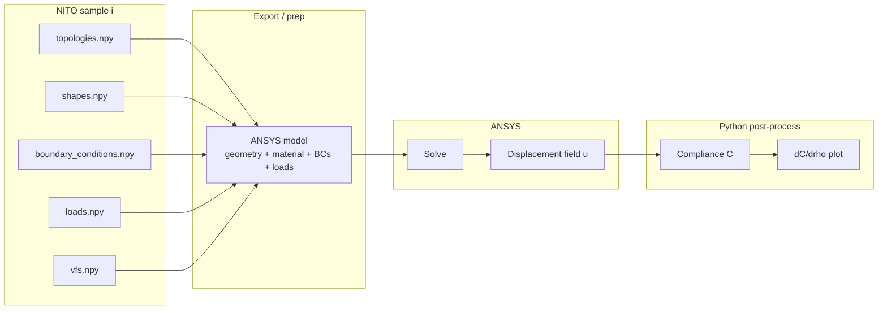
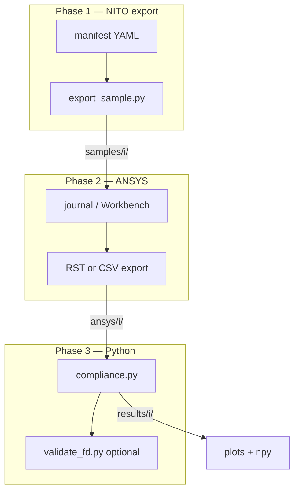

# TOSA Sprint Guide — Data, ANSYS, and Sensitivity Post-Processing

**TOSA** (this repo) implements sensitivity analysis of topology-optimized designs: how **global compliance** \(C\) responds to **design variables** (e.g. element densities \(\rho_e\)) for a fixed set of constraints and loads.

**NITO-3D** is the upstream public dataset (reference designs and problem definitions). We do **not** re-run NITO training in this sprint; we use NITO cases as inputs to an independent FEA + sensitivity pipeline.

## Sprint goal

| Stage | Tool | Output |
|-------|------|--------|
| Problem definition | NITO `.npy` + export scripts | Geometry/topology, mesh resolution, BCs, loads, \(V_f\) |
| Forward FEA | **ANSYS** | Displacement field \(\mathbf{u}\) (and optionally strain energy per element) |
| Sensitivity & viz | **Python** | Compliance \(C\), gradient \(\partial C / \partial \rho_e\) (or \(\partial C / \partial \rho\)), plots |

ANSYS is the source of truth for the **displacement field** under the chosen material model and boundary conditions. Python aggregates ANSYS exports into **compliance** and the **compliance gradient** for plotting and comparison with theory (e.g. adjoint / SIMP-style sensitivities).

## End-to-end pipeline



### What each layer is responsible for

**NITO data (index `i`)**

- `topologies[i]` → material layout / design variables \(\rho\) on a structured voxel grid.
- `shapes[i]` → \((n_x, n_y, n_z)\) element counts (physical domain size must be chosen or inferred when building the ANSYS model).
- `boundary_conditions[i]`, `loads[i]` → sparse point constraints and forces (normalized coordinates; scale by `np.max(shapes[i])` for physical placement — see below).
- `vfs[i]` → target volume fraction (constraint reference, not necessarily enforced in a one-off ANSYS run).

**ANSYS**

- Build mesh and material model (linear elasticity is the usual starting point).
- Apply displacement BCs and forces consistent with the NITO case.
- Solve and export **nodal or element results** needed for compliance and sensitivities (at minimum displacements; element strain energy density simplifies gradient assembly).

**Python**

- Read ANSYS exports (CSV, RST via `ansys-mapdl-reader`, ACT result files, etc. — choose one format and stick to it).
- Compute **compliance** from reactions/energy or \(\mathbf{F}^\top \mathbf{u}\) on the loaded DOFs.
- Compute **\(\partial C / \partial \rho_e\)** for plotting (see [Compliance and sensitivity](#compliance-and-sensitivity-post-processing)).

## Compliance and sensitivity (post-processing)

For linear elasticity with external loads \(\mathbf{F}\) and stiffness \(\mathbf{K}(\boldsymbol{\rho})\):

\[
C = \mathbf{F}^\top \mathbf{u} = \mathbf{u}^\top \mathbf{K} \mathbf{u}
\]

Design variables are the **element (or voxel) densities** \(\rho_e\) used in topology optimization (SIMP-style penalization may apply in the reference NITO solver; match that exponent if comparing to published compliances).

A standard **element-wise compliance sensitivity** (used in density-based TO) is:

\[
\frac{\partial C}{\partial \rho_e} = -p \, \rho_e^{p-1} \, \mathbf{u}_e^\top \mathbf{K}_e \mathbf{u}_e
\]

where \(p\) is the penalization power and \(\mathbf{u}_e\), \(\mathbf{K}_e\) are the element displacement and stiffness in local form. Equivalently, this is often implemented using **strain energy density** from the solved field: Python can sum/contour-map \(\partial C / \partial \rho_e\) per element if ANSYS exports per-element energy or if \(\mathbf{u}\) is mapped back to a consistent mesh.

**Sprint deliverables (Python side):**

- One sample index \(i\) end-to-end: NITO → ANSYS → export → \(C\) and \(\partial C / \partial \rho\) fields.
- Plots: topology, \(|\mathbf{u}|\) or components, and sensitivity map (e.g. voxel-colored \(\partial C / \partial \rho_e\)).
- Document ANSYS export format and unit/coordinate conventions.

**Open engineering choices** (decide early):

| Choice | Notes |
|--------|--------|
| Physical domain size | NITO stores grid dimensions in voxels; assign \(L_x, L_y, L_z\) or unit cell size for ANSYS. |
| Material model | Start with uniform \(E, \nu\); void/solid via \(\rho_e\) or element kill. |
| Mesh ↔ voxel mapping | 1:1 hex elements vs coarser ANSYS mesh; sensitivities must use the same DOF/element numbering as \(\rho\). |
| ANSYS product | Mechanical (MAPDL) vs Workbench; drives export path and automation (APDL / PyMechanical / journal files). |

## Suggested next steps (sprint order)

1. **Environment** — Python 3.10+ (`tosa` env); ANSYS install/license confirmed.
2. **Data** — Download NITO data into `nito/Data/` (~85 MB test split under `nito/Data/Test/`); pick 1–3 fixed indices for the sprint.
3. **Visual sanity check** — `authors_reading.ipynb` or `nates_reading.py` to confirm topology, BCs, loads for those indices.
4. **ANSYS case 0** — Manual (or scripted) model for one index: mesh, BCs, loads, solve, export \(\mathbf{u}\).
5. **Python reader** — Script to load ANSYS output + compute \(C\) and a first sensitivity map; plot alongside topology.
6. **Batch / parametric** — Optional: loop indices or perturb \(\rho_e\) for finite-difference checks on \(\partial C / \partial \rho_e\).
7. **Scale up** — More indices or train split only if needed for statistics.

## Feasibility, maintainability, and environment (recommendations)

### Feasibility — sprint is realistic with tight scope

| In scope for a sprint | Out of scope (defer) |
|------------------------|----------------------|
| 1–3 NITO indices end-to-end | Batch all 122K cases in ANSYS |
| One consistent mesh/voxel convention | Perfect match to NITO SIMP compliance values |
| Python \(C\) and \(\partial C/\partial\rho_e\) maps + plots | Fully automated ANSYS from day one |
| FD check on one element’s \(\rho\) | Rebuilding NITO’s GPU solver or training |

**What will take the most time:** not the sensitivity formula in Python, but **building the first ANSYS model** that matches NITO’s topology, BCs, and loads (normalized coordinates, sparse point constraints, void/solid material layout). Treat the first case as a **geometry/BC translation problem**; post-processing is straightforward once exports share the same element ordering as \(\rho\).

**Highest risk:** mesh and design variables not aligned (ANSYS mesh ≠ NITO voxel grid). Fix by committing to **one structured hex mesh** with the same \(n_x \times n_y \times n_z\) as `shapes[i]` and a written unit scale (e.g. 1 voxel = 1 mm).

**De-risk path:** solve index `i` manually in ANSYS → export → Python → compare one FD perturbation on a single voxel before automating export or batching.

### Maintainability — keep stages separable

Design the repo so each stage has a **stable contract** (inputs/outputs on disk), not shared global state in a notebook.

```text
nito/Data/               # raw NITO .npy (from download.py; gitignored)
output/
  atoms_results/{i}/     # ATOMS: C, dC/drho, U, rho (from sensitivity script)
  manifest/              # optional YAML per index: units, penalization p, file paths
  samples/{i}/           # optional per-index exports / meta
```

Principles:

- **Manifest per sample** (`samples/{i}/meta.yaml`): `index`, `shape`, `Lx,Ly,Lz`, `p`, `E`, `nu`, paths to ANSYS export. Reproducibility lives here.
- **Python postprocess has no ANSYS license dependency** if you export CSV or VTK from ANSYS; use `ansys-mapdl-reader` only if you standardize on `.rst`.
- **Do not fork NITO_Public** into TOSA; clone beside the repo and pin a commit hash in the manifest or root README.
- **Notebooks for exploration only**; scripts (`export_sample.py`, `compliance.py`) for the pipeline you keep.
- **Version the export schema** (column names, units) in `meta.yaml` when it changes.

### Pipeline — three phases, one interface



| Phase | Owner | Automation level (sprint) |
|-------|--------|---------------------------|
| **1. Export** | Python | Script from `.npy` → `samples/{i}/` (high value, low risk) |
| **2. FEA** | ANSYS | **Manual first**, then APDL/journal template per `shape` class |
| **3. Post** | Python | Fully scripted; unit-testable with a tiny synthetic mesh |

Phase 2 should not block Phase 3: stub a **minimal fake export** (one hex, known \(\mathbf{u}\)) so sensitivity code and plots can be developed in parallel with ANSYS setup.

### Environment — two tiers, not the full NITO stack

ANSYS is **outside** conda; Python env only needs what post-processing and NITO export use.

**Tier A — `tosa` (daily driver, any machine)**

| Package | Purpose |
|---------|---------|
| `python=3.10` | Match existing notebook / NITO notes |
| `numpy`, `scipy` | Arrays, optional sparse helpers |
| `matplotlib` | Sensitivity / topology plots |
| `pandas` | ANSYS CSV tables |
| `pyyaml` | Sample manifests |
| `gdown` | One-time NITO download |
| `scikit-image` | Optional; marching-cubes viz |
| `pyvista` | Optional; `nates_reading.py` only |

**Tier B — add when export format is fixed**

| Package | When |
|---------|------|
| `ansys-mapdl-reader` | Standardizing on `.rst` from MAPDL |
| `ansys-mechanical-stubs` / PyMechanical | Only if you automate Mechanical **and** have a licensed install on that machine |

**Do not install for this sprint:** PyTorch, TensorFlow, full `NITO_Public/environment.yml` (CUDA, training stack), unless you explicitly train NITO models later.

**ANSYS:** document product (Mechanical vs MAPDL), version, and license server in team notes — not in conda. Run ANSYS on a **designated workstation**; commit **exported results** (or store on shared drive) so others can run Tier A postprocess without a license.

**Suggested files in repo:**

```text
requirements.txt       # Tier A pins
environment.yml        # optional conda mirror of Tier A
.gitignore             # *.npy data, ansys/{i}/*.rst, large results
```

### Summary recommendation

1. **Scope:** prove the loop on **one index**, then three; ignore train-scale data until the contract is stable.
2. **Pipeline:** manifest-driven folders; script export + postprocess; ANSYS manual → templated.
3. **Environment:** slim `tosa` conda env for Python; ANSYS separate; add `ansys-mapdl-reader` only if you commit to RST.
4. **Validation:** one FD perturbation on \(\rho\) before trusting \(\partial C/\partial\rho_e\) plots.
5. **Maintainability:** freeze units, `p`, and mesh rules in `meta.yaml`; keep ANSYS artifacts and Python code in sibling directories.

---

## NITO-3D data reference

The sections below cover dataset source, size, download, and the existing visualization notebooks.

## Source project

| Item | Link / note |
|------|-------------|
| **Consolidated repo** | [ahnobari/NITO_Public](https://github.com/ahnobari/NITO_Public) |
| **Legacy 3D repo** | [Lyleregenwetter/NITO-3D](https://github.com/Lyleregenwetter/NITO-3D) — redirects to NITO_Public; do not rely on it |
| **Paper** | [NITO-3D PDF](https://decode.mit.edu/assets/papers/nobari_2024_nito3d.pdf) |
| **Manual download** | [Data & checkpoints (Drive)](https://drive.google.com/drive/folders/1_wKPq8HXjaoRa4oCy_tvLOopIcapk7wO?usp=sharing), [3D data folder](https://drive.google.com/drive/folders/1uK_X3-FcCWY9LiiXkVQDI69q0t6Vosgm) |

Clone **NITO_Public** for `download.py` and reference code. Data is **not** in git; it comes from Google Drive.

## Dataset scale (122K public outputs)

From the NITO-3D paper (Table 1) and measured Drive file sizes:

| Metric | Value |
|--------|--------|
| Topologies (headline) | **~122,000** |
| Total voxel elements | **4.3 billion** |
| Voxels per topology (min / max) | **32,000 / 48,000** (e.g. 40×40×20, 120×40×10) |
| Held-out test set | **5,000** samples |
| Unique BC templates | **210** configurations, **7** domain shapes/resolutions |

**On-disk size (train + test, all five `.npy` files each):**

| Bundle | Location | Size |
|--------|----------|------|
| Train | `Data/*.npy` | **~4.64 GB** (`topologies.npy` alone ~4.02 GB) |
| Test | `Data/Test/*.npy` | **~85 MB** |
| **Total** | | **~4.72 GB** |

After download, confirm sample count:

```python
import numpy as np
print(len(np.load("shapes.npy")))  # expect ~122K for train
print(len(np.load("Test/shapes.npy")))  # expect 5000 for test
```

**RAM note:** Loading the full train set with `np.load(..., allow_pickle=True)` can use noticeably more than 5 GB RAM due to pickle/object-array overhead. Prefer the **test split** for early exploration.

## Files and layout

**Raw NITO data** lives in the submodule (not in `output/`):

```
nito/Data/
  shapes.npy
  boundary_conditions.npy
  loads.npy
  topologies.npy
  vfs.npy
  Test/                # test split (~85 MB)
    *.npy
```

**This folder (`output/`)** holds TOSA notebooks, docs, and run artifacts:

```
output/
  README.md
  authors_reading.ipynb
  nates_reading.py
  atoms_results/{i}/   # written by scripts/sensitivity_analysis/main.py
```

Download with `python download.py --data` from `nito/` (default `nito/Data/`).

### Per-sample schema (index `i`)

All arrays are aligned by integer index `i`:

| Array | Content |
|-------|---------|
| `shapes[i]` | Grid size `(nelx, nely, nelz)` |
| `topologies[i]` | Flattened density field → `reshape(shapes[i], order='C')` |
| `boundary_conditions[i]` | Cols `0:3` normalized position; `3:` constraint flags |
| `loads[i]` | Cols `0:3` position; `3:` force direction |
| `vfs[i]` | Target volume fraction |

**Coordinate scaling:** BC/load positions in the files are normalized. Scale by `np.max(shapes[i])` when plotting (see comments in `nates_reading.py` / notebook).

## Download

From a clone of NITO_Public (needs `gdown`):

```bash
conda activate tosa
./scripts/fetch_data.sh --test-only    # sprint default: nito/Data/Test/ (~85 MB)
# or: python scripts/fetch_nito_data.py --test-only
```

Full train + test (~4.7 GB): `./scripts/fetch_data.sh --full`

Upstream bulk download (no test-only): `cd nito && python download.py --data`

There is no official per-sample download API (whole files only).

**Train-only or test-only:** edit `download.py` to run only `data_ids` or `test_data_ids`, or download individual files manually from Drive using the IDs in `download.py`.

**Checkpoints** (optional, for running their models): `python download.py --checkpoints` — not needed for the ANSYS + sensitivity sprint.

## Python environment

Recommended for both notebooks/scripts (Python **3.10** matches the notebook kernel that was used):

```text
numpy
matplotlib
scikit-image    # authors_reading.ipynb (marching cubes)
pyvista         # nates_reading.py (interactive 3D)
jupyter
ipykernel
gdown           # for download.py
# Add when ANSYS export format is chosen, e.g.:
# ansys-mapdl-reader   # RST results
# pandas               # CSV exports
```

**Skip unless needed:** `tensorflow` (imported in the notebook but unused), full NITO_Public `environment.yml` (PyTorch/CUDA stack) unless training NITO models.

**Future repo layout (planned):**

```text
output/
  atoms_results/{i}/   # compliance.npy, dC_drho.npy, displacement.npy, ...
```

Example conda env:

```bash
conda create -n tosa python=3.10 -y
conda activate tosa
conda install -c conda-forge numpy matplotlib scikit-image pyvista jupyter ipykernel gdown -y
python -m ipykernel install --user --name tosa --display-name "tosa"
```

## Visualization (sanity checks)

Verify topology, BCs, and loads before running sensitivity analysis:

```bash
conda activate tosa
python scripts/inspect_nito_dataset.py --test          # 2D vs 3D counts and templates
python scripts/visualize_nito_sample.py --index 0 --test
python scripts/visualize_nito_sample.py --index 0 --test --save output/figures/sample_0.png --no-show
```

| Script | Stack | Notes |
|--------|--------|------|
| `scripts/visualize_nito_sample.py` | PyVista | CLI: one index, optional PNG export |
| `authors_reading.ipynb` | Matplotlib + scikit-image marching cubes | Authors’ plotting style |
| `nates_reading.py` | PyVista | Legacy loop over indices 0–19 |

## Pull-only-what-you-need workflow

NITO supports **index-based** use after files exist, not streaming single samples from the cloud.

| Level | What’s possible |
|-------|------------------|
| **Remote** | Whole files only (5 train + 5 test) |
| **Local index** | `i`, `ID_IDX`, `--start_index` / `--end_index` in NITO `train.py` / `evaluate.py` |
| **Memory** | Official scripts still `np.load()` entire `.npy` files before slicing indices |

**Practical TOSA approach:**

1. **Sprint start:** download only `Data/Test/*.npy` (~85 MB, 5k samples).
2. **Work by index:** e.g. `ID_IDX = 10` in the notebook, or `topologies[i]` in the script.
3. **Full train later:** download train bundle (~4.6 GB) when sensitivity/training needs it.
4. **Optional cache layer:** extract chosen indices to `output/cache/{i}/` so TOSA code does not load 122K samples every run (not provided by NITO; add locally if needed).

`shapes.npy` and `vfs.npy` are small — useful to download first for scouting indices before pulling `topologies.npy`.

## NITO reference: training index range

If using NITO_Public training/eval later:

```bash
python train.py --data ./Data --start_index 0 --end_index 1000
```

This limits which indices are processed but **does not** avoid loading full `.npy` files into memory.

## Open questions / gaps

**Data (NITO)**

- Paper mentions both **106,425** and **122K** topology counts; verify with `len(shapes)` after download.
- No per-sample metadata file — derive filters from `shapes[i]`, `vfs[i]`, and BC/load patterns.
- **Hongrui’s clarification:** multiply normalized BC/load positions by `np.max(dims)` when placing BCs/loads in ANSYS or plots.

**ANSYS + sensitivity**

- Fixed physical domain size and SIMP penalization \(p\) if comparing to NITO reference compliance.
- Whether ANSYS exports **reactions + displacements** only, or also **element strain energy** (affects simplest gradient implementation).
- Validation: compare Python \(\partial C / \partial \rho_e\) to finite differences on one voxel for a single case.

## Related files

| File | Role |
|------|------|
| `authors_reading.ipynb` | Visual check — matplotlib / marching cubes |
| `nates_reading.py` | Visual check — PyVista |
| `NITO_Public/download.py` | Dataset download |
| `NITO_Public/NITO/utils.py` | `NITO_Dataset.load(idx)` — reference for indexing |
| *(planned)* `postprocess/compliance.py` | Compliance + gradient from ANSYS exports |
| *(planned)* `samples/export_ansys.py` | NITO index → ANSYS input |
